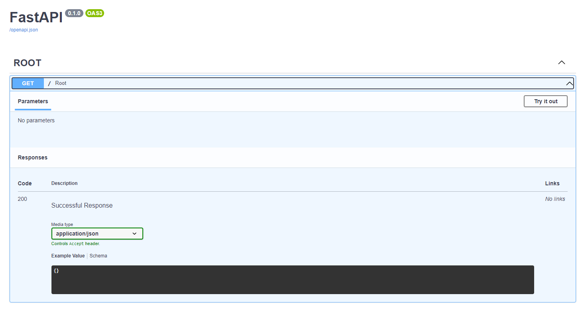

# Basic-FastAPI-Python-APPARKY

>
> In This Project We learn how to start with [__FastAPI__](https://fastapi.tiangolo.com/lo/)
> 
> FastAPI is an Open Source Library in Python, used to create Servers just like Django & Flask, with more use case and 
> for API deployment (mostly for ML & AI integrations)
> 
> To Start with you'll need 3 Libraries named as
> 
> - FastAPI
> - Uvicorn
> - Starlette
> 
> The Following command is used to download the required libraries
> 
```commandline
pip install fastapi
pip install uvicorn
pip install statlette
```
>
> We also provide `requirement.txt` with this project repo you can also download and install all dependencies form this file.
> 
> Commands to install dependencies from `requirement.txt` is given billow
> 
```commandline
pip install -r requirement.txt

```
> 
> Now you are ready to code
> 
> #### Step 1
> 
> Create a Directory named `fastapi` [You can use any made up names]
>
> #### Step 2
> 
> Create a file named `main.py`
> 
> Copy and Paste the following code in to that file
> 
```commandline
import uvicorn


if __name__ == '__main__':
    uvicorn.run("app.app:app", port=8001, reload=True)

```


>
> #### Step 3
> 
> Create another Directory in the main Directory named `app`
> 
> 
> #### Step 4
> 
> Create two files named `__init__.py` and `app.py`
> 
> Copy and Paste the following code in to the `app.py` file
```commandline
from fastapi import FastAPI

app = FastAPI()


@app.get("/", tags=['ROOT'])
async def root() -> dict:
    return {'Twinkle Twinkle': 'Little Star'}
```

> use of `async` before defining the function is good practice for [__FastAPI__](https://fastapi.tiangolo.com/lo/), and the function returns the `Dictionary` which is denoted as `dict`
> 
> 

>
> 
> Your Server is ready to fire.
> 
> Open the terminal and run this command
```commandline
python main.py
```
>
> You'll see the server is running like this fashion
> 
```commandline
(venv) PS C:\Users\...\fastapi> python main.py
INFO:     Will watch for changes in these directories: ['C:\\Users\\...\\fastapi']
INFO:     Uvicorn running on http://127.0.0.1:8001 (Press CTRL+C to quit)
INFO:     Started reloader process [7936] using StatReload               
INFO:     Started server process [8788]
INFO:     Waiting for application startup.
INFO:     Application startup complete.   
INFO:     127.0.0.1:54208 - "GET / HTTP/1.1" 200 OK

```

> Now open this link [http://127.0.0.1:8001](http://127.0.0.1:8001) in to your Browser.
> 
> This is how it looks like
> 
> [](https://apparky.vercel.app/)
> 
> [](https://apparky.vercel.app/)
> 
> 
> Now got to this Link [http://127.0.0.1:8001/docs](http://127.0.0.1:8001/docs) . The page will look like this
> 
> [](https://apparky.vercel.app/)
> 
> 
> Now Click on `Try it out` and then Click on `Execute`
> 
> [](https://apparky.vercel.app/)
> 
> Then you'll see some message and a link has been displayed billow the `Execute` Button like this
> 
> [](https://apparky.vercel.app/)
> 
> Now Copy the command from the `Curl`
> 
> [](https://apparky.vercel.app/)
```commandline
curl -X 'GET' \
  'http://127.0.0.1:8001/' \
  -H 'accept: application/json'
```

> And Paste it on `GitBash` Terminal. You can see the message on the terminal like this
> 
> [](https://apparky.vercel.app/)
> 
> 
> This is basic app by [__FastAPI__](https://fastapi.tiangolo.com/lo/)
> You can also
> 
> - Create
> - Read
> - Update
> - Delete
>
> by using `FastAPI`
> 
> And the method we use to do for that are
> 
> - Get
> - Post
> - Put
> - Delete
> 
> 
> Let's see how the `Get` method is looks like
> 
> 

## Get Method:
> 
> Create another function and do the same for the Basic App Creation just like this
>
```commandline
# Get Method to create a post
@app.get("/val", tags=['VAL'])
async def val() -> dict:
    return {'data': values}


values = [

    {
        'id': '1',
        'name': 'APPARKY'
    },
    {
        'id': '2',
        'name': 'Apparium'
    }
]
```
> 
> This is similar to Basic App, Except we return variable named `value` and pass a dictionary in it.
> This is How the OutPut Looks like for Get Method
> 
> [](https://apparky.vercel.app/)
> 
> [](https://apparky.vercel.app/)
> 
> > Now got to this Link [http://127.0.0.1:8001/docs](http://127.0.0.1:8001/docs) . The page will look like this
> 
> [](https://apparky.vercel.app/)
> 
> 
> Now Click on `Try it out` and then Click on `Execute`
> 
> [](https://apparky.vercel.app/)
>
> 
> Now Copy the command from the `Curl`
> 
> [](https://apparky.vercel.app/)
```commandline
curl -X 'GET' \
  'http://127.0.0.1:8001/val' \
  -H 'accept: application/json'
```

> And Paste it on `GitBash` Terminal. You can see the message on the terminal like this
> 
> [](https://apparky.vercel.app/)
> 
> 

## Post Method
> Create another function for `Post` just like this
> 
```commandline
@app.post("/val", tags=['VAL'])
async def post_val(val: dict) -> dict:
    values.append(val)
    return {
        'data': 'Data Has been added Successfully'
    }
```

> In this function a parameter has been assigned in a form of dictionary, by which we can save data.
> 
> Let's see how dose it looks like
> 
> [](https://apparky.vercel.app/)
> 
> Now expand it and click on `Try it out` and then Paste data on Request Body section like this
> 
```commandline
{
      "id": "3",
      "name": "Tame The Codes"
    }
```

Click on `Execute`. This is how it looks like..
> 
> [](https://apparky.vercel.app/)
> 
> To check if the was added or not, follow the Get Method to see the data..
> 
> [](https://apparky.vercel.app/)
> 
> Here you can see the Data has been added.
> 
> You can also use `Curl` To add Data. We already discuss about `Curl`, this is the code
> 
```commandline
 curl -X 'POST' \
  'http://127.0.0.1:8001/val' \
  -H 'accept: application/json' \
  -H 'Content-Type: application/json' \
  -d '{
      "id": "3",
      "name": "Tame The Codes"
    }'
```
> 
> This is how it looks like..
> 
> [](https://apparky.vercel.app/)
> 
> 
> You can see the on this link [http://localhost:8001/val](http://localhost:8001/val) . And this is how it looks like..
> 
> [](https://apparky.vercel.app/)
> 
> [](https://apparky.vercel.app/)
> 

## Put Method
> Put Method is used to Update the Stored Date. Create a Function on `app.py` for that like this :
> 
```commandline
@app.put("/val{_id}", tags=['VAL'])
async def put_val(_id: int, body: dict) -> dict:
    for val in values:
        if int(val['id']) == _id:
            print(val['id'])
            print(_id)
            val['name'] = body['name']
            return {
                'data': f'Values with id {_id} has been updated'
            }
    return {
        'data': f'id {_id} not Found'
    }
```
> 
> This is how the web page looks like :
> 
> [](https://apparky.vercel.app/)
> 
> Again follow the same method Click to `Try it out` give the `id` on `_id` section and Click on `Execute`.
> This is how it looks like.
> 
> [](https://apparky.vercel.app/)
> 
> This is the `Curl` for the same
> 
> [](https://apparky.vercel.app/)
> 
> This is how `Curl` looks like on `GitBash`
> 
> [](https://apparky.vercel.app/)
> 
> Now click on this link [http://localhost:8001/val](http://localhost:8001/val) . Check the value here .
> 
> [](https://apparky.vercel.app/)
> 
> 
> 

## Delete Method
>
> As the name says, this will delete the data. Code for that are given billow
> 
```commandline
@app.delete("/val{_id}", tags=['VAL'])
async def delete_val(_id: int) -> dict:
    for val in values:
        if int(val['id']) == _id:
            values.remove(val)
            return {
                "data": f"id {_id} has been updated"
            }

    return {
        "data": f"id {_id} not Found"
    }
```
> This is how it looks like ...
> 
> [](https://apparky.vercel.app/)
> 
> To Delete data follow the same ..
> 
> [](https://apparky.vercel.app/)
> 
> `Curl` Code to Delete data ..
> 
> [](https://apparky.vercel.app/)
> 
> 
> 
> We are done.
> 
> Thanks and regards [Apparky](https://apparky.vercel.app/)
> 
> 
> 
> 
> -------------------------------------------------------------------
> -------------------------------------------------------------------
> To get more interesting projects follow our GitHub page at [Here](https://github.com/Apparky)
> 
> To get more interesting projects follow our Bitbucket page at [Here](https://bitbucket.org/apparky-web/workspace/overview)
> 
> To know more about [__APPARKY__](https://apparky.vercel.app/) Click [Here](https://apparky.vercel.app/)
> 
> 
> 
> 
> 
