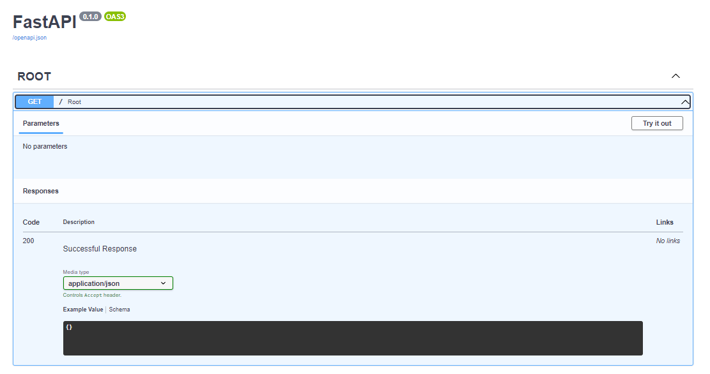
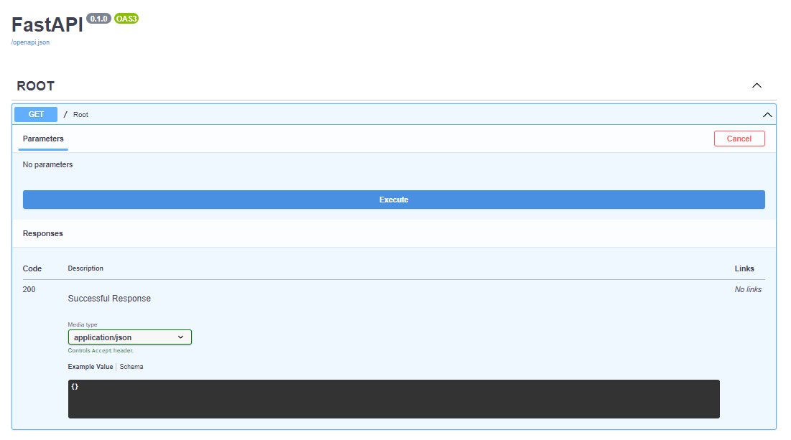
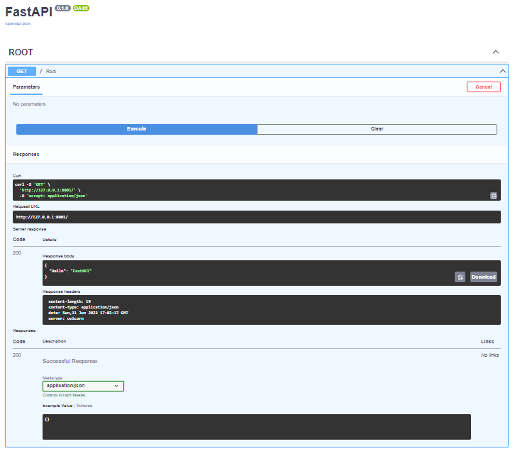
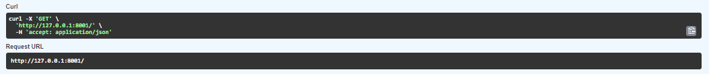

> #### Step 1
> 
> Create a Directory named `fastapi` [You can use any made up names]
>
> #### Step 2
> 
> Create a file named `main.py`
> 
> Copy and Paste the following code in to that file
> 
```commandline
import uvicorn


if __name__ == '__main__':
    uvicorn.run("app.app:app", port=8001, reload=True)

```


>
> #### Step 3
> 
> Create another Directory in the main Directory named `app`
> 
> 
> #### Step 4
> 
> Create two files named `__init__.py` and `app.py`
> 
> Copy and Paste the following code in to the `app.py` file
```commandline
from fastapi import FastAPI

app = FastAPI()


@app.get("/", tags=['ROOT'])
async def root() -> dict:
    return {'Hello': 'FastAPI'}
```

> use of `async` before defining the function is good practice for [__FastAPI__](https://fastapi.tiangolo.com/lo/), and the function returns the `Dictionary` which is denoted as `dict`
> 
> 

>
> 
> Your Server is ready to fire.
> 
> Open the terminal and run this command
```commandline
python main.py
```
>
> You'll see the server is running like this fashion
> 
```commandline
(venv) PS C:\Users\...\fastapi> python main.py
INFO:     Will watch for changes in these directories: ['C:\\Users\\...\\fastapi']
INFO:     Uvicorn running on http://127.0.0.1:8001 (Press CTRL+C to quit)
INFO:     Started reloader process [7936] using StatReload               
INFO:     Started server process [8788]
INFO:     Waiting for application startup.
INFO:     Application startup complete.   
INFO:     127.0.0.1:54208 - "GET / HTTP/1.1" 200 OK

```

> Now open this link [http://127.0.0.1:8001](http://127.0.0.1:8001) in to your Browser.
> 
> This is how it looks like
> 
> [](https://apparky.vercel.app/)
> 
> [](https://apparky.vercel.app/)
> 
> 
> Now got to this Link [http://127.0.0.1:8001/docs](http://127.0.0.1:8001/docs) . The page will look like this
> 
> [](https://apparky.vercel.app/)
> 
> 
> Now Click on `Try it out` and then Click on `Execute`
> 
> [](https://apparky.vercel.app/)
> 
> Then you'll see some message and a link has been displayed billow the `Execute` Button like this
> 
> [](https://apparky.vercel.app/)
> 
> Now Copy the command from the `Curl`
> 
> [](https://apparky.vercel.app/)
```commandline
curl -X 'GET' \
  'http://127.0.0.1:8001/' \
  -H 'accept: application/json'
```

> And Paste it on `GitBash` Terminal. You can see the message on the terminal like this
> 
> [](https://apparky.vercel.app/)
> 
> 
> This is basic app by [__FastAPI__](https://fastapi.tiangolo.com/lo/)
> You can also
> 
> - Create
> - Read
> - Update
> - Delete
>
> by using `FastAPI`
> 
> And the method we use to do for that are
> 
> - Get
> - Post
> - Put
> - Delete
> 
> 
> Let's see how the `Get` method is looks like.
> 
> 
