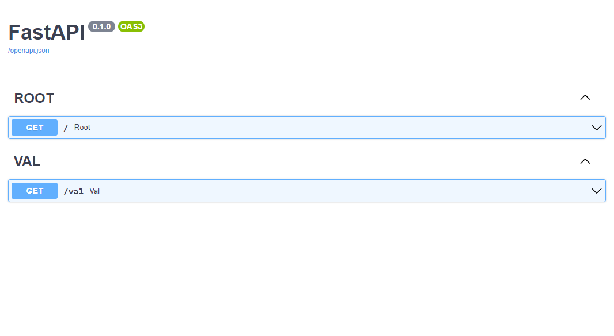
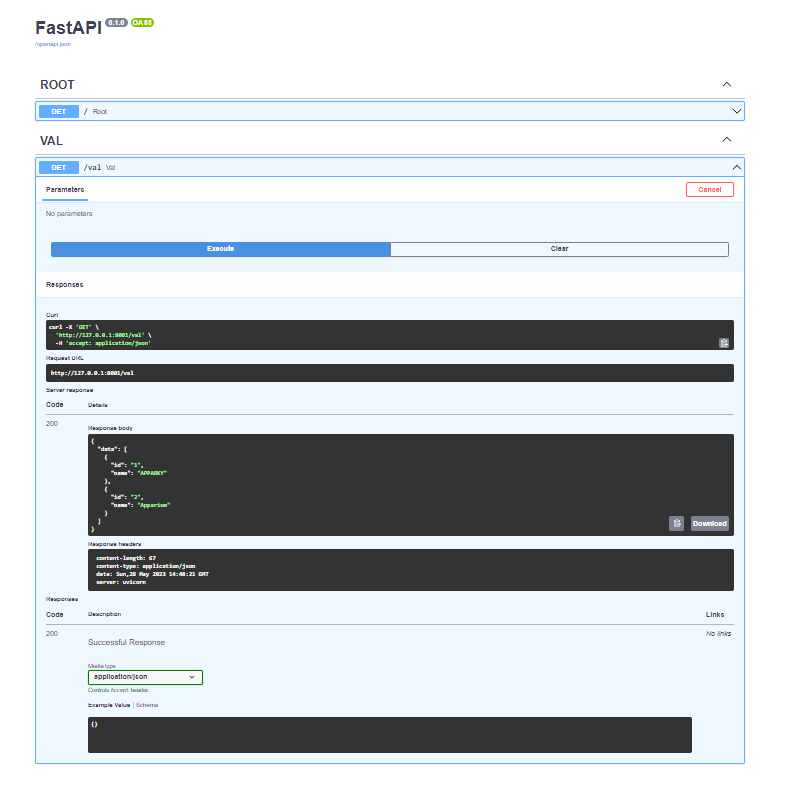

## Get Method:
> 
> Create another function and do the same for the Basic App Creation just like this
>
```commandline
# Get Method to create a post
@app.get("/val", tags=['VAL'])
async def val() -> dict:
    return {'data': values}


values = [

    {
        'id': '1',
        'name': 'APPARKY'
    },
    {
        'id': '2',
        'name': 'Apparium'
    }
]
```
> 
> This is similar to Basic App, Except we return variable named `value` and pass a dictionary in it.
> This is How the OutPut Looks like for Get Method
> 
> [](https://apparky.vercel.app/)
> 
> [](https://apparky.vercel.app/)
> 
> > Now got to this Link [http://127.0.0.1:8001/docs](http://127.0.0.1:8001/docs) . The page will look like this
> 
> [](https://apparky.vercel.app/)
> 
> 
> Now Click on `Try it out` and then Click on `Execute`
> 
> [](https://apparky.vercel.app/)
>
> 
> Now Copy the command from the `Curl`
> 
> [](https://apparky.vercel.app/)
```commandline
curl -X 'GET' \
  'http://127.0.0.1:8001/val' \
  -H 'accept: application/json'
```

> And Paste it on `GitBash` Terminal. You can see the message on the terminal like this..
> 
> [](https://apparky.vercel.app/)
> 
> 