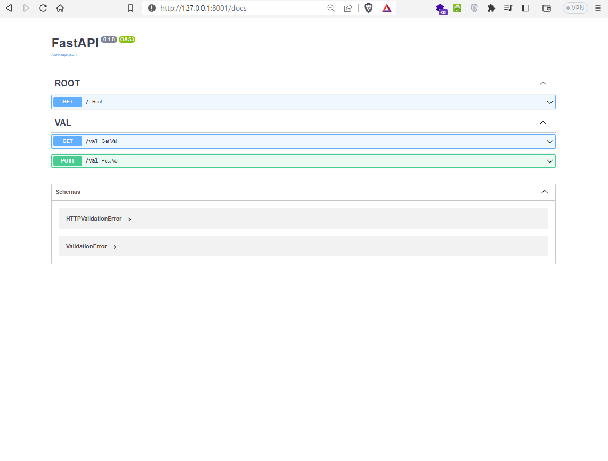
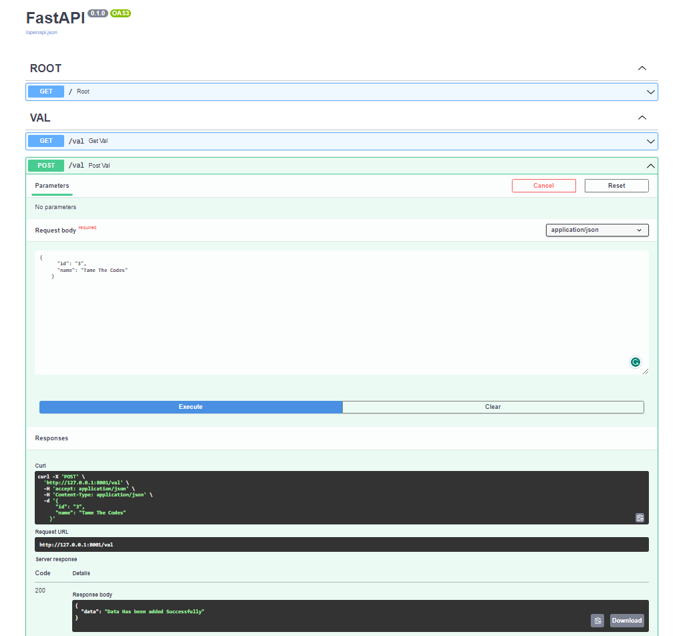
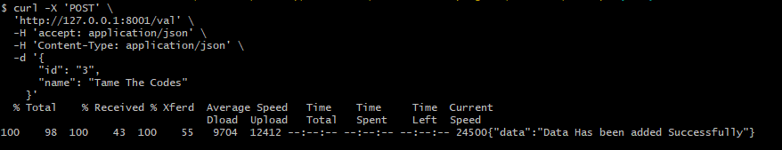
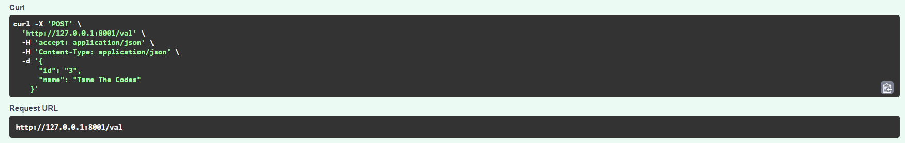
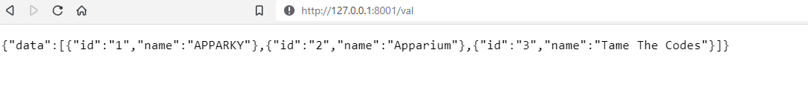

## Post Method
> Create another function for `Post` just like this
> 
```commandline
@app.post("/val", tags=['VAL'])
async def post_val(val: dict) -> dict:
    values.append(val)
    return {
        'data': 'Data Has been added Successfully'
    }
```

> In this function a parameter has been assigned in a form of dictionary, by which we can save data.
> 
> Let's see how dose it looks like
> 
> [](https://apparky.vercel.app/)
> 
> Now expand it and click on `Try it out` and then Paste data on Request Body section like this
> 
```commandline
{
      "id": "3",
      "name": "Tame The Codes"
    }
```

Click on `Execute`. This is how it looks like..
> 
> [](https://apparky.vercel.app/)
> 
> To check if the was added or not, follow the Get Method to see the data..
> 
> [](https://apparky.vercel.app/)
> 
> Here you can see the Data has been added.
> 
> You can also use `Curl` To add Data. We already discuss about `Curl`, this is the code
> 
```commandline
 curl -X 'POST' \
  'http://127.0.0.1:8001/val' \
  -H 'accept: application/json' \
  -H 'Content-Type: application/json' \
  -d '{
      "id": "3",
      "name": "Tame The Codes"
    }'
```
> 
> This is how it looks like..
> 
> [](https://apparky.vercel.app/)
> 
> 
> You can see the on this link [http://localhost:8001/val](http://localhost:8001/val) . And this is how it looks like..
> 
> [](https://apparky.vercel.app/)
> 
> [](https://apparky.vercel.app/)
> 
> 
> 
> [Click](step_2_GET_Method.md) Here to go to [Previous](step_2_GET_Method.md) Step
> [Click](step_4_PUT_Method.md) Here to to to [Next](step_4_PUT_Method.md) Step
> 
> 
> [Click](../README.md) Here to go to main [Overview](../README.md) Page 
