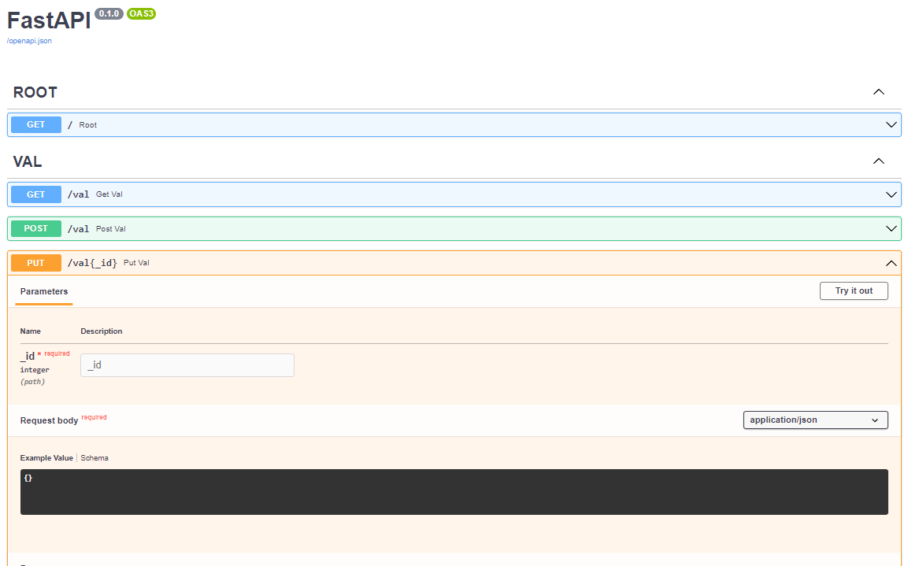
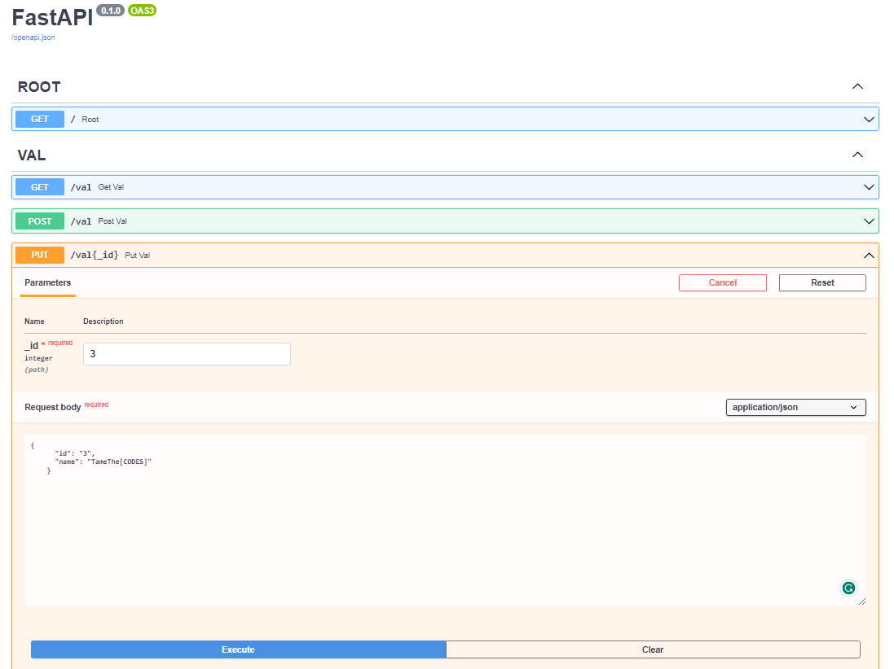
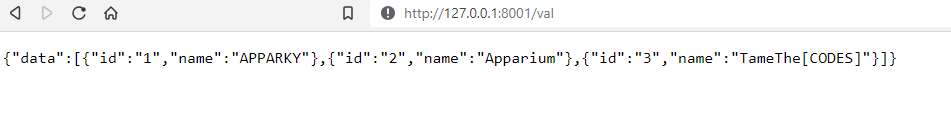

## Put Method
> Put Method is used to Update the Stored Date. Create a Function on `app.py` for that like this :
> 
```commandline
@app.put("/val{_id}", tags=['VAL'])
async def put_val(_id: int, body: dict) -> dict:
    for val in values:
        if int(val['id']) == _id:
            print(val['id'])
            print(_id)
            val['name'] = body['name']
            return {
                'data': f'Values with id {_id} has been updated'
            }
    return {
        'data': f'id {_id} not Found'
    }
```
> 
> This is how the web page looks like :
> 
> [](https://apparky.vercel.app/)
> 
> Again follow the same method Click to `Try it out` give the `id` on `_id` section and Click on `Execute`.
> This is how it looks like.
> 
> [](https://apparky.vercel.app/)
> 
> This is the `Curl` for the same
> 
> [](https://apparky.vercel.app/)
> 
> This is how `Curl` looks like on `GitBash`
> 
> [](https://apparky.vercel.app/)
> 
> Now click on this link [http://localhost:8001/val](http://localhost:8001/val) . Check the value here .
> 
> [](https://apparky.vercel.app/)
> 
> 
> 
